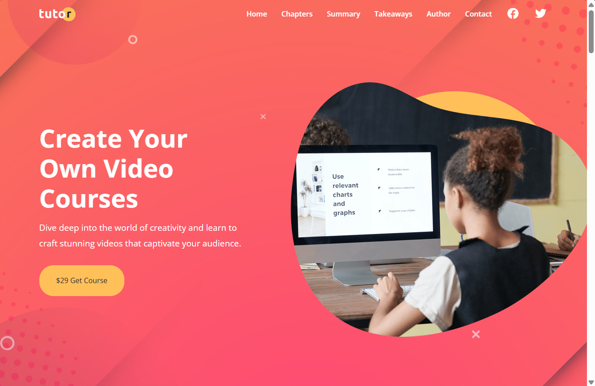

# 📚 Tutor — Video Course Landing Page

A clean, responsive website for a video course about planning and creating engaging content. It guides visitors through the course chapters, key takeaways, author details, and a contact page.

  

---

## ✨ What’s Inside

- 🎬 A course landing page with a clear introduction and call to action
- 📖 Course chapters, learning topics, and key takeaways
- ✍️ An author section to introduce the course creator
- 📩 A finished contact page for visitor questions and inquiries
- 📱 Responsive navigation and layouts for desktop and mobile
- 🎨 Custom styling, course imagery, and subtle animations

## 🛠️ Built With

- HTML5
- CSS3
- JavaScript
- Font Awesome

## 🚀 Run It Locally

1. Download or clone this project.
2. Open `index.html` in your browser, or start a local server from the project folder.
3. Use the navigation to explore the course sections and contact page.

## 🌐 Deployment

The website is deployed on **Vercel**. Add the public deployment URL here so visitors can open the live site directly.

## 📁 Project Files

- `index.html` — Main course landing page
- `contact.html` — Contact page
- `css/` — Stylesheets and animation styles
- `js/` — Interactive behavior
- `images/` — Course graphics and site assets
- `screenshot.png` — Website preview

---

Built by **Liam Araya** as part of my front-end project journey. Thanks for stopping by, and enjoy exploring the course! 🚀
